# Systeme de gestion de laboratoire Labo Pro

Ce depot contient le code source de Labo Pro, une application de bureau developpee en JavaFX et MySQL destinee a la gestion complete des laboratoires d'analyses medicales. Elle propose des outils de suivi des dossiers patients, de planification des examens et de facturation, avec un support natif pour le changement de theme en temps reel.

---

## Guide visuel de l'interface

Le dossier de captures d'ecran montre les differents aspects de l'interface graphique a travers douze captures distinctes.

### Tableau de bord general et vue principale

* **Vue globale en mode clair (1.png)** : Cette capture montre le tableau de bord general lors du premier demarrage en mode clair. L'arriere-plan blanc pur et les cartes d'indicateurs de couleur claire mettent en evidence le nombre de patients inscrits, les analyses en cours et les gains financiers. Le graphique central montre la repartition quotidienne des analyses.
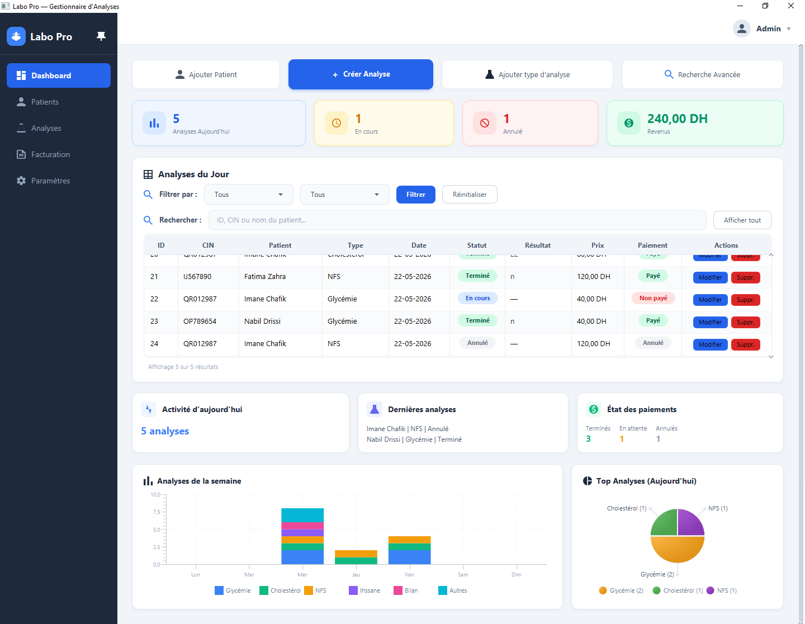

* **Liste et recherche de patients (2.png)** : Illustre le panneau de recherche et de consultation de la base de donnees des patients. Une barre de saisie permet de filtrer en temps reel la liste des dossiers par nom ou par numero de carte nationale (CIN).


### Fenetres de saisie et boites de dialogue

* **Ajout de patient (6.png)** : Boite de dialogue modale destinee a la creation d'une nouvelle fiche patient avec validation des champs.

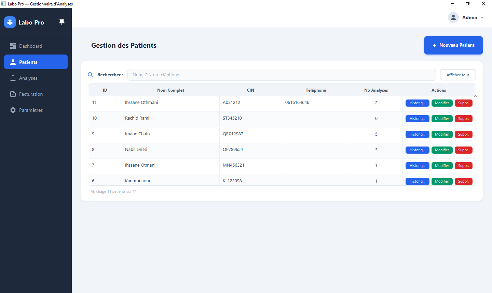


* **Enregistrement d'analyse (7.png)** : Fenetre d'attribution d'un examen medical a un patient existant avec selection pre-remplie.

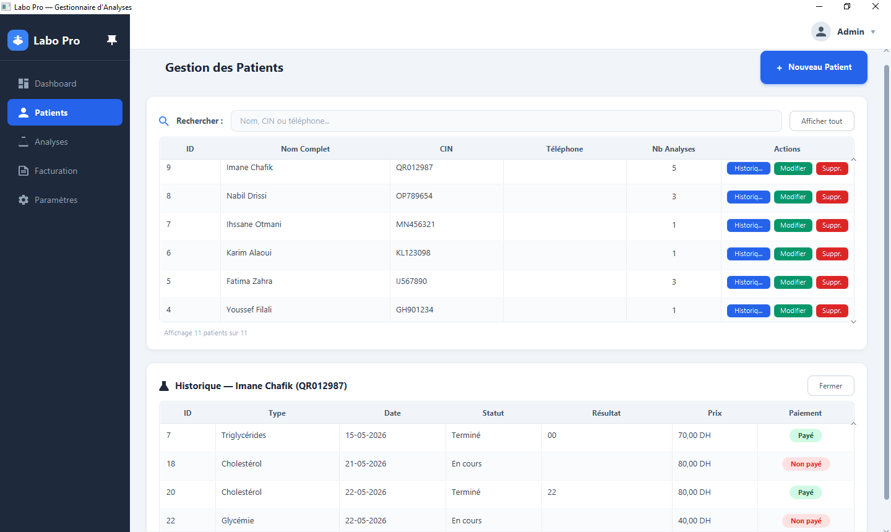

* **Saisie des resultats numeriques (8.png)** : Formulaire de validation des mesures du laboratoire par rapport aux valeurs de reference.
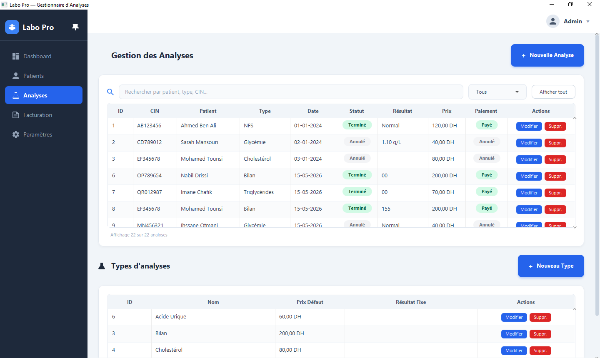

* **Filtres de recherche multicriteria (9.png)** : Panneau de recherche approfondie pour extraire l'historique d'un patient.
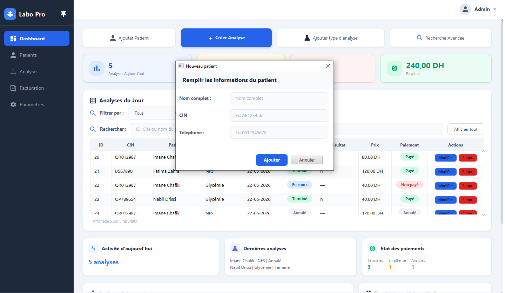


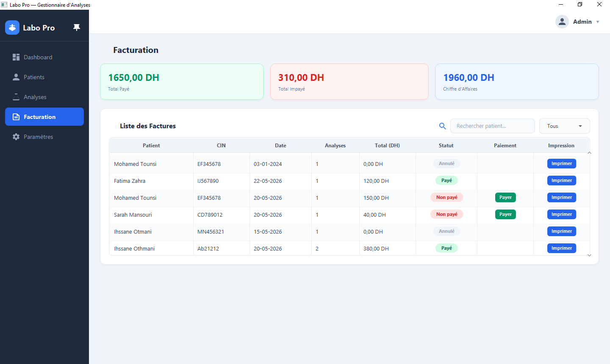


### Gestion des examens et base de donnees

* **Liste des analyses medicales (3.png)** : Affiche le tableau de suivi des examens medicaux avec les statuts colores pour chaque echantillon.
* **Detail de la facturation et paiements (4.png)** : Montre la gestion financiere de chaque dossier avec les boutons contextuels pour declencher un encaissement rapide ou imprimer une quittance.
* **Formulaire de configuration du laboratoire (5.png)** : Permet de renseigner les informations de contact et le nom du medecin biologiste responsable pour personnaliser l'en-tete des documents.


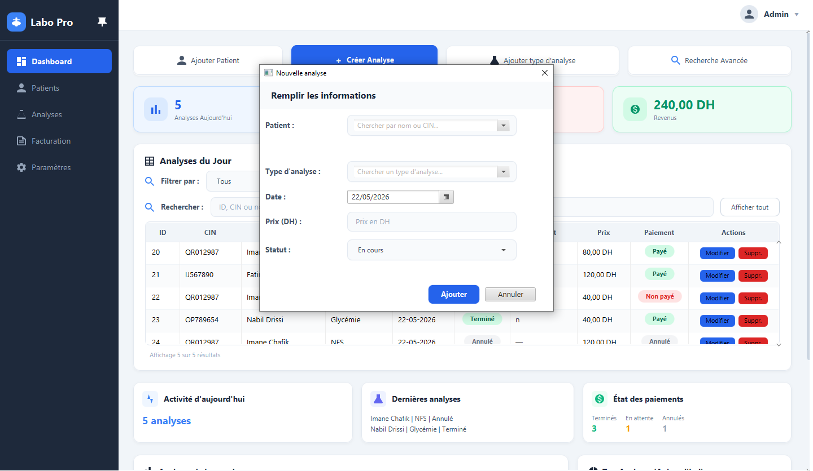
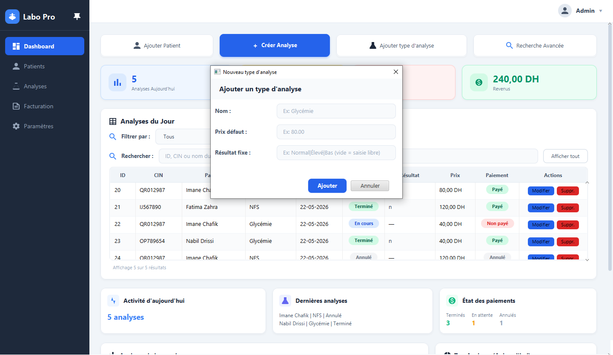
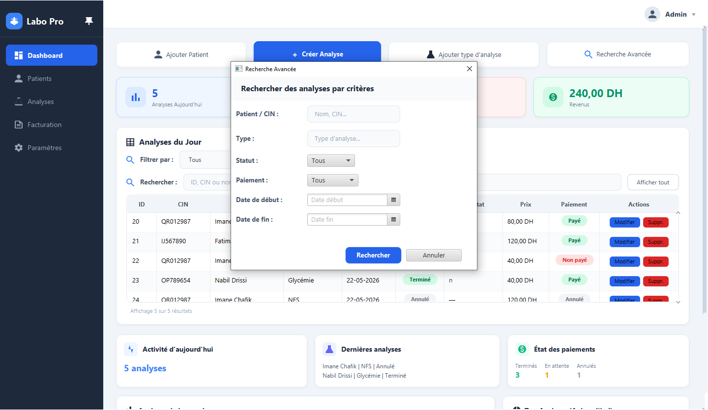


### Interface en mode sombre premium

* **Dashboard en mode sombre (10.png)** : Affiche la transition complete de l'interface centrale vers un theme ardoise fonce (`#1E293B`) avec des textes contrastes en gris clair (`#E2E8F0`).
* **Tableau des analyses en mode sombre (11.png)** : Montre le rendu du tableau d'analyses sous le theme sombre, garantissant que les statuts restent parfaitement lisibles.
* **Popups et menus styles (12.png)** : Illustre l'application reussie du style sombre sur les fenetres volantes de type ComboBox et les fenetres de calendrier DatePicker.


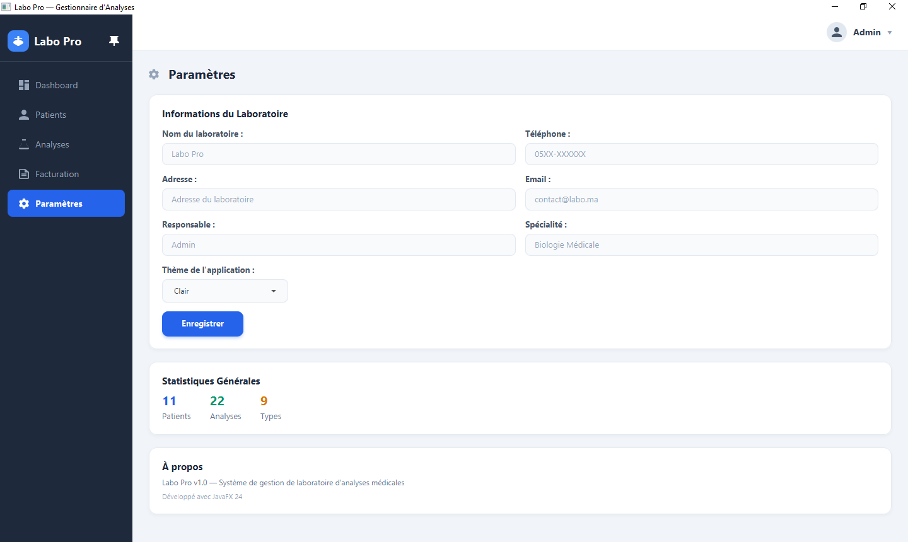
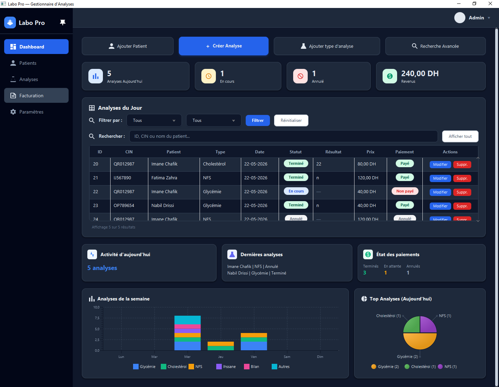
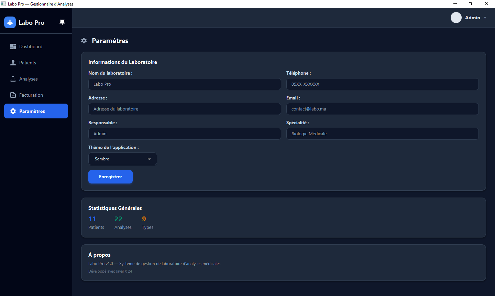

---

## Architecture et fonctionnement du code

L'application est construite selon le patron de conception MVC (Modele-Vue-Controleur) associe a des objets d'acces aux donnees (DAO) pour isoler les requetes SQL du reste de la logique applicative.

* **Modele** : Les classes du dossier `src/model` representent les entites de la base de donnees sous forme de Java Beans simples.
* **Vue** : Les fichiers FXML du dossier `src/view` definissent la structure de l'interface tandis que les fichiers CSS appliquent la charte graphique.
* **Controleur** : Les controleurs du dossier `src/controller` interceptent les evenements utilisateur et mettent a jour la vue en fonction des donnees.
* **DAO** : Les classes du dossier `src/dao` executent les requetes SQL de creation, lecture, mise a jour et suppression dans la base MySQL.

### Logique du changement de theme

La bascule entre le mode clair et le mode sombre s'effectue dynamiquement en memoire. Lorsqu'un utilisateur selectionne le mode sombre, le controleur charge la feuille de style `dark-theme.css` et l'ajoute directement au noeud racine de la scene principale. Pour resoudre les limitations de JavaFX avec les fenetres secondaires (dialogues et menus contextuels), le controleur applique la feuille de style au niveau de l'objet scene de chaque dialogue et propage le style aux popups du systeme.

---

## Fonctionnalites principales

* **Suivi des dossiers patients** : Enregistrement, recherche rapide par numero de carte nationale (CIN) ou par nom, et historique complet des examens associes.
* **Gestion des analyses** : Parametrage des types d'examens avec des valeurs de reference et des tarifs pre-configures. Suivi de l'etat d'avancement des echantillons.
* **Facturation integre** : Suivi des paiements, encaissement rapide en un clic et generation automatique de factures pretes a l'impression.
* **Statistiques interactives** : Graphiques de repartition et indicateurs financiers mis a jour en temps reel a chaque modification de donnees.

---

## Guide d'installation et de configuration

### Configuration de la base de donnees

1. Assurez-vous qu'un serveur MySQL local est actif sur votre machine.
2. Executez le script SQL fourni a la racine pour initialiser les tables et les donnees initiales :
   ```bash
   mysql -u root -p < "script base de donnee.sql"
   ```

### Lancement rapide sous Windows

Un script automatique est fourni pour compiler et lancer l'application en un clic. Double-cliquez simplement sur le fichier :
```bash
run.bat
```

### Importation dans IntelliJ IDEA

1. Ouvrez IntelliJ IDEA et importez le dossier racine du projet.
2. Dans la configuration de la structure du projet, definissez le SDK de projet sur Java 17 ou une version superieure.
3. Ajoutez le dossier `lib/javafx-sdk-24.0.1/lib` comme bibliotheque globale de projet.
4. Creez une nouvelle configuration d'application pour executer la classe principale `Main`.
5. Ajoutez les parametres VM suivants pour charger les modules de l'interface graphique :
   ```text
   --module-path "lib/javafx-sdk-24.0.1/lib" --add-modules javafx.controls,javafx.fxml
   ```
6. Executez l'application.

---

## Licence

Ce projet est distribue sous la licence MIT. Vous pouvez librement l'utiliser et le modifier.
